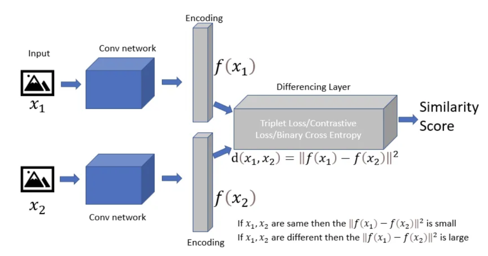
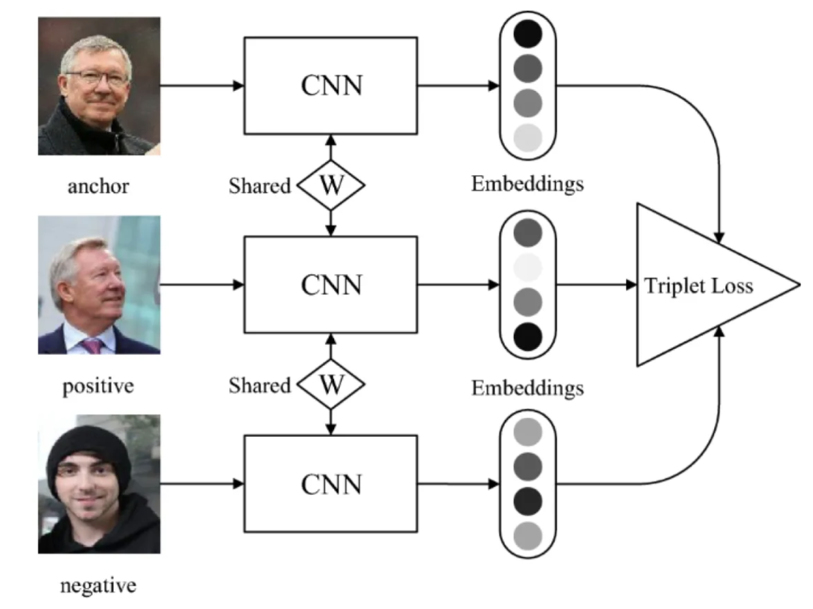
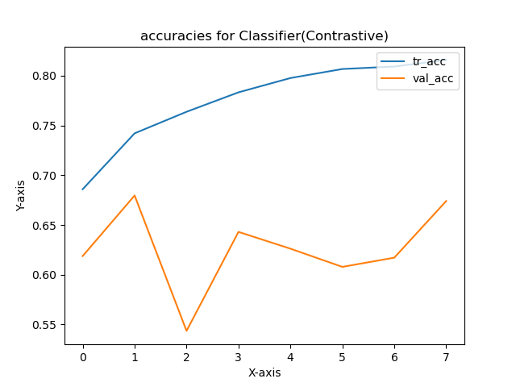
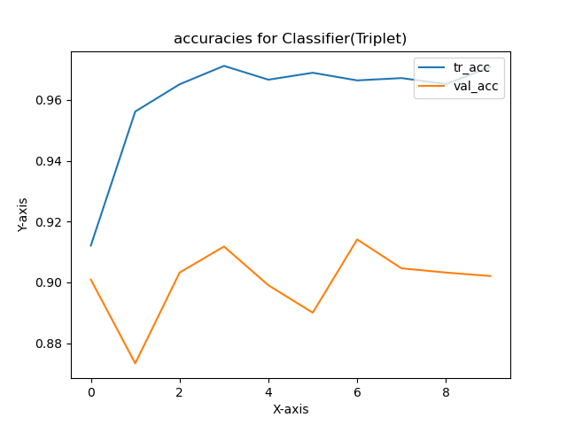

# Siamese Network for AD Detaction

In this project, we leveraged Siamese Networks, a metric learning technich, to classify Alzheimer's Disease (AD) from 2D MRI scans.

## Environment
- python 3.10.9
- pytorch 1.12.1
- torchvision 0.13.1

## Dataset

**Source**: 
- [ADNI dataset](https://cloudstor.aarnet.edu.au/plus/s/L6bbssKhUoUdTSI) for Alzheimer’s disease.

**Classes**:
- AD (Alzheimer's Disease)
- CN (Cognitively Normal)

**Training Data**: 
- AD: 10,400 images (520 patients)
- CN: 11,120 images (556 subjects)

Training data is split into training and validation sets using an 8:2 ratio, ensuring a patient-level split.

**Testing Data**:
- AD: 4,460 images (223 patients)
- CN: 4,540 images (227 subjects)

The test set is reserved for final model evaluation.

### Datasets for Siamese networks:
- **ContrastiveDataset**: Pairs of images labeled as being from the same class or different classes.
- **TripletDataset**: Triplets of images - an anchor, a positive (same class as anchor), and a negative (different class from anchor).

### Datasets for classification:
- **ClassificationDataset**: Individual images labeled as either AD or CN.

### example usage:
```
full_train_data = discover_directory(Config.TRAIN_DIR)
    train_data, val_data = patient_level_split(full_train_data)

    tr_transform = tf.Compose([
        tf.Normalize((0.1160,), (0.2261,)),
        tf.RandomRotation(10)
    ])

    val_transform = tf.Compose([
        tf.Normalize((0.1160,), (0.2261,))
    ])

    train_dataset = ContrastiveDataset(train_data, transform=tr_transform)
    val_dataset = ContrastiveDataset(val_data, transform=val_transform)
```


## Model
Although siamese neural network is originally designed as a metric learning technique, 
it can still be adeptly repurposed for classification task, which is attributed to its inherent capability to distinguish between input images.

### Siamese Network Architecture

**Contrastive Structure**:



**Triplet Structure**:


**Components**:
- **Two/Three Identical Subnetworks**: These subnetworks share the same architecture, weights. Each subnetwork takes one of the two/three input vectors.
- **Feature Vectors**: As each subnetwork processes its input, and it subsequently output a feature vector.
- **Distance Layer**: After processing, the feature vectors are combined (using Euclidian distance), and the network outputs a scalar value that indicates how similar the inputs are.


The figure above shows the subnetworks structure proposed by Koch et. in 2015.
Although other CNN architectures might offer better performance, time constraints limited exploration in that direction.

### Architecture of Classification Network
After training the siamese network, 
the pre-trained Subnetwork is then used as backbone(with weights frozen) to extract embeddings for the classification network,
followed by a classification layer. The classification network is then trained as usual image classification task.

### example usage:
```
embedding_net = Embedding_Baseline()
siamese_c = SiameseContrastive(embedding_net)
siamese_t = SiameseTriplet(embedding_net)
classifier = ClassificationNet(embedding_net)
```


## Training Siamese Networks
During the training process, 2 losses were explored: Contrastive Loss and Triplet Loss. 
Both these losses have significant performance in metric leaning tasks. 

#### Contrastive Loss
Contrastive loss is commonly used in siamese networks. 
It ensures that similar instances come closer in the feature space, 
while dissimilar instances are pushed apart. Mathematically, it can be represented as:

$$
Contrastive Loss = (1-Y) * D^2 + Y * max((m-D),0)^2
$$

- D is the Euclidean distance between the two feature vectors.
- Y is 1 if the pair is from the same class, O otherwise.
- m is a margin, which ensures that dissimilar pairs are separated by at least m distance.


The idea is to minimize the distance between positive pairs (similar instances) 
and maximize the distance between negative pairs (dissimilar instances) up to 
a certain margin.

It is notable that the choice of margin can influence the performance.

### Triplet Loss
Triplet Loss extends the idea of contrastive loss by considering an anchor example, 
a positive example (similar to the anchor), and a negative example 
(dissimilar to the anchor). The goal is to make sure that an anchor is closer 
to the positive example than the negative by at least a margin. 
The formula for the Triplet Loss is:

$$
Triplet Loss = max(D_{a,p} - D_{a,n} + margin, 0)
$$

- $D_{a,p}$  is the distance between the anchor and positive sample.
- $D_{a,n}$  is the distance between the anchor and negative sample.

The loss encourages the model to make the positive pair closer than the negative pair by at least a margin of 
m.

### example usage:
```
# train Siamese network using Contrastivd Loss
python3 train.py -m Contrastive -bs 32 -lr 0.0001

# train Siamese network using Contrastivd Loss
python3 train.py -m Triplet -bs 16 -lr 0.00001
```

### Training Loss of Siamese Network

**Siamese Network using Contrastive Loss**:


**Siamese Network using Triplet Loss**:


## Training Classification Network
After Siamese networks trained, the shared subnetwork can be integrated as the backbone(with frozen weights) 
in a classification network for feature extraction. the classification networks trained fast with early stopping, 
which could be attributed to the already trained and frozen backbone. 
Thus, only the classification layer need to be trained in this step.

Interestingly, the classification network that using the backbone trained with triplet loss outperforms its counterpart, 
achieving a commendable validation accuracy of 91.41%. 
In contrast, using the backbone trained with contrastive loss yields a validation accuracy of 67.96%.

### example usage:
```
# train Classifier network using pretrained embedding from Contrastivd Loss
python3 train.py -m Classification -bm ./model/Contrastive.pth

# train Classifier network using pretrained embedding from Triplet Loss
python3 train.py -m Classification -bm ./model/Triplet.pth
```

### Training loss & accuracy for Classification

**Classification using backbone trained with Contrastive Loss**:




**Classification using backbone trained with Triplet Loss**:




## Result

### Test Accuracies
In addition to using frozen backbones for classification, I also experimented with fine-tuning the pretrained backbones during the training of the classification networks. 
This was done to evaluate potential improvements, as end-to-end models often deliver superior performance.

The test accuracies are shown as below:
| Contrastive Backbone (frozen) | Triplet Backbone (frozen) | Contrastive Backbone (fine-tuned) | Triplet Backbone (fine-tuned) |
|:--------:|:--------:|:--------:| :--------:|
| 62.99% | 77.27% | 71.66% | 77.63% |

### example usage:
```
python3 predict.py -m ./model/Classifier_c.pth -t test
python3 predict.py -m ./model/Classifier_t.pth -t test
python3 predict.py -m ./model/Classifier_cf.pth -t test
python3 predict.py -m ./model/Classifier_tf.pth -t test
```

### prediction 
Instead of generating patient-level predictions using full-sized MRIs with all 20 scans, 
the networks use only a single image as input to provide prediction. 
I believe it approach is advantageous with the capability to diagnose AD using only one MRI slice,
which potentially reducing both time and costs. 
Furthermore, although this method emphasizes single-slice predictions, 
it retains the flexibility to make patient-level predictions 
by aggregating individual slice results using a majority vote

The following illustrates how the model (using frozen triplet backbone) provide prediction:


### example usage:
```
python3 predict.py -m ./model/Classifier_tf.pth -t preimage_predict -d ./AD_NC/test/AD/388206_94.jpeg
python3 predict.py -m ./model/Classifier_tf.pth -t preimage_predict -d ./AD_NC/test/NC/1182968_108.jpeg
``` 


